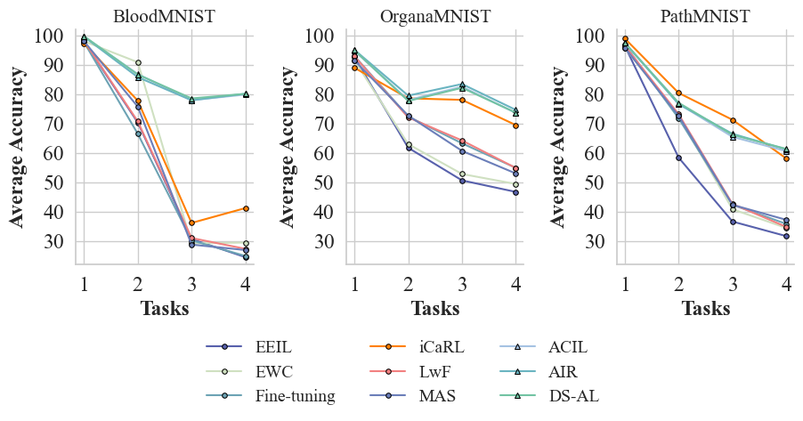

# **AIDC: Benchmark for Analytical Learning in Incremental Disease Classification**

## **Abstract**

Class Incremental Learning (CIL) aims to enable models to continuously learn new categories while retaining previous classification abilities. In medical scenarios, where new disease categories frequently emerge, CIL becomes crucial. Traditional CIL approaches often face the issue of "catastrophic forgetting". Analytical Class Incremental Learning (ACIL) offers an analytical (i.e., closed-form) linear solution that does not depend on conventional replay or regularization techniques, thereby mitigating forgetting and addressing privacy concerns, making it suitable for medical datasets. However, few studies have explored the problem of knowledge forgetting in CIL for medical data using ACIL. Based on the latest research, we systematically study this problem for the first time. Specifically, we present a benchmark named AIDC (Analytical Incremental Disease Classification), which compares ACIL against five established CIL methods across three medical datasets. The results show that ACIL achieves notably higher average classification accuracy and exhibits better anti-forgetting capabilities compared to traditional methods.

Our code will be available after the paper is accepted.

